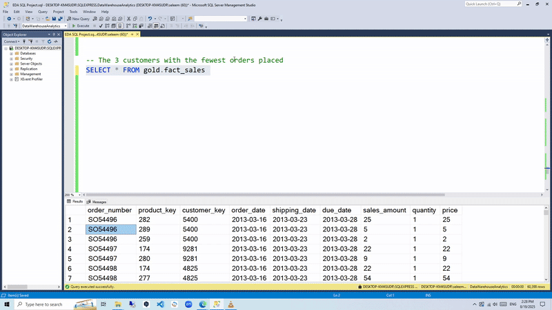

# SQL Exploratory Data Analysis - Retail Business Intelligence

## 📊 Project Overview

This project demonstrates comprehensive exploratory data analysis (EDA) using SQL on a retail/e-commerce dataset. The analysis aims to extract valuable business insights from sales data to support data-driven decision making for stakeholders.

## 🎥 Live Demo

Watch SQL queries in action:



*Live demonstration of key SQL queries and business insights extraction*

## 🎯 Business Problem

Retail businesses face several key challenges:

- **Lack of visibility** into overall business performance and key metrics
- **Limited understanding** of customer behavior and geographical distribution
- **Insufficient insights** into product performance across different categories
- **No clear picture** of sales trends and revenue drivers
- **Difficulty identifying** top and bottom performers (products/customers)

## 💡 Solution Approach

This SQL analysis addresses these challenges by:

1. **Database Structure Exploration** - Understanding the data architecture and available information
2. **Comprehensive Business Metrics** - Calculating key performance indicators (KPIs)
3. **Customer Analytics** - Analyzing customer distribution and behavior patterns
4. **Product Performance Analysis** - Evaluating product categories and individual product success
5. **Revenue Analysis** - Identifying revenue drivers and patterns
6. **Performance Ranking** - Determining top and bottom performers

## 🗃️ Database Schema

The analysis works with a **star schema data warehouse** containing:

### Dimension Tables
- **`dim_customers`** - Customer information including demographics and geography
- **`dim_products`** - Product catalog with categories, subcategories, and pricing

### Fact Table
- **`fact_sales`** - Transactional sales data with quantities, prices, and amounts

## 🔍 Key Analysis Areas

### 1. Database Exploration
- Schema discovery and table structure analysis
- Data quality assessment and null value handling

### 2. Dimensional Analysis
- Unique countries and customer geographical distribution
- Product categorization and hierarchy exploration

### 3. Temporal Analysis
- Business operation timeframe (first to last order dates)
- Customer age demographics analysis

### 4. Key Business Metrics
Generated comprehensive business intelligence report including:
- **Total Sales Revenue**
- **Unique Items Sold**
- **Average Selling Price**
- **Total Orders Processed**
- **Total Products in Catalog**
- **Customer Base Size**
- **Active Customers (who placed orders)**

### 5. Segmentation Analysis
- Customer distribution by country and gender
- Product portfolio analysis by category
- Revenue breakdown by product categories
- Sales performance across geographical regions

### 6. Performance Ranking
- Top 5 highest revenue-generating products
- Bottom 5 worst-performing products
- Top 10 most valuable customers
- Customers with lowest order frequency

## 📈 Key Insights Delivered

The analysis provides actionable insights for:
- **Strategic Planning** - Understanding business scale and performance
- **Marketing Optimization** - Identifying key customer segments and regions
- **Product Management** - Recognizing successful and underperforming products
- **Customer Relationship Management** - Focusing on high-value customers
- **Inventory Management** - Data-driven decisions on product categories

## 🛠️ Technical Skills Demonstrated

### SQL Functions & Techniques Used:
- **Aggregate Functions**: `SUM()`, `COUNT()`, `AVG()`, `MIN()`, `MAX()`
- **Data Filtering**: `WHERE`, `HAVING`, `DISTINCT`
- **Date Functions**: `DATEDIFF()`
- **Null Handling**: `NULLIF()`
- **Joins**: `INNER JOIN` between fact and dimension tables
- **Ranking**: `TOP` for performance analysis
- **Data Organization**: `GROUP BY`, `ORDER BY`
- **Advanced Queries**: `UNION ALL` for consolidated reporting

### Database Concepts:
- Star schema data warehouse design
- Dimension and fact table relationships
- Information schema exploration
- Data quality assessment

## 📁 Repository Structure

```
EDA_SQL_project/
├── EDA SQL Project.sql          # Main analysis file
└── README.md                    # Project documentation
```

## 🚀 How to Use

1. **Prerequisites**: Access to a SQL database with the retail dataset
2. **Setup**: Import the dataset following the star schema structure
3. **Execution**: Run the SQL queries sequentially for comprehensive analysis
4. **Interpretation**: Use the results to generate business insights and reports

## 📊 Business Value

This analysis framework can be applied to:
- **E-commerce platforms** - Understanding online sales patterns
- **Retail chains** - Multi-location performance analysis
- **Product companies** - Category and item performance evaluation
- **Customer analytics** - Behavioral and demographic insights

## 🎯 Future Enhancements

- Time series analysis for seasonal trends
- Customer segmentation using RFM analysis
- Cohort analysis for customer retention
- Predictive analytics for sales forecasting
- Geographic visualization of sales data

---

*This project showcases practical SQL skills for business intelligence and data analysis in a retail context.*
